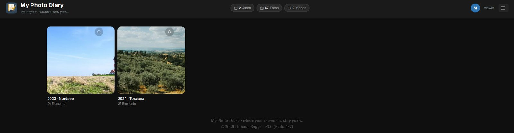
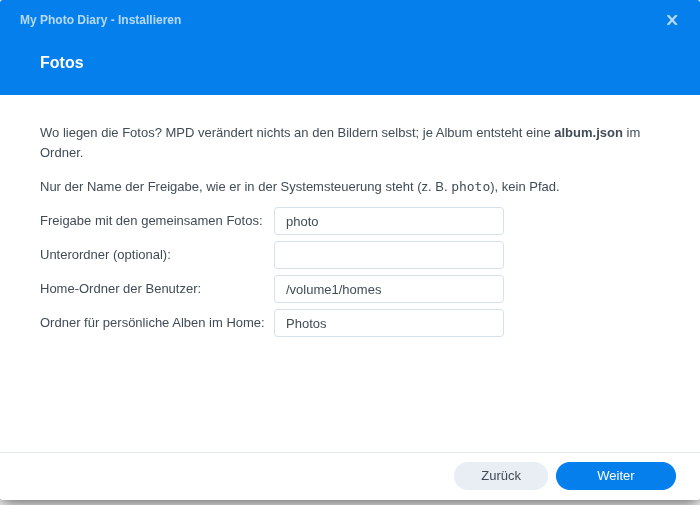
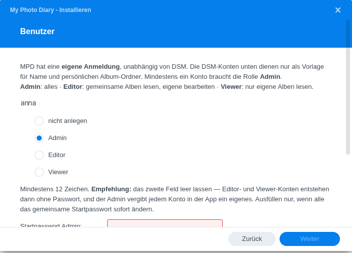
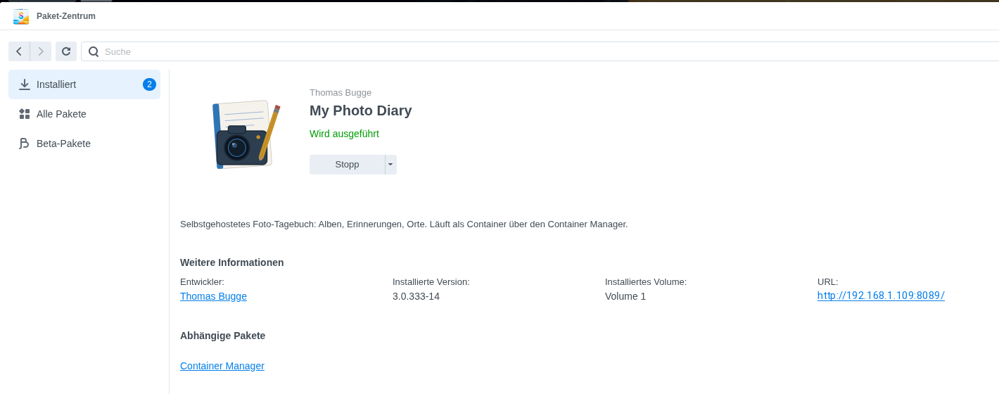

# My Photo Diary — Core

**A self-hosted photo diary for your NAS — where your memories stay yours.**

> 🇩🇪 [Deutsche Fassung: README.de.md](README.de.md)

My Photo Diary (MPD) turns folders of photos into diaries: photos, videos, text,
maps, GPS tours, audio and documents, arranged in the order *you* choose. It runs
in a single Docker container on your own hardware — no cloud, no account with
anyone, no algorithm deciding what you see.

This repository is **MPD Core**, the open-source heart of My Photo Diary. It is
complete on its own: everything you need to keep, write and share a family
diary is here. Optional **MPD Plus** modules add analysis on top — see
[Core and Plus](#core-and-plus).



---

## Install on Synology

A Synology package (`.spk`) for DSM 7 is published with the
[releases](https://github.com/thobgg/my-photo-diary-core/releases). It
installs through Package Center → Manual Install, asks for your photo share and
accounts in a wizard, and needs Container Manager. See the
[installation guide](spk/docs/MPD_Installationsanleitung_v0_2.pdf) (PDF, German; a bilingual HTML version ships inside the package).

| | |
|---|---|
|  |  |
| The wizard asks for the name of the photo share, not a path | One role per DSM account; MPD keeps its own login |



---

## Why MPD

- **Your files stay files.** An album *is* a folder with your photos and one
  `album.json` next to them. No import, no database for your content, nothing
  to get out of sync. Copy the folder and you have copied the album.
- **An open, documented format.** `album.json` follows the
  [PDX specification](docs/specs/PDX_SPEC_v1_5.pdf) (Photo Diary Exchange,
  v1.5) — plain JSON, human-readable, versioned, forward-compatible. If MPD
  disappeared tomorrow, your albums would still be readable.
- **A diary, not a feed.** Text blocks between photos, chapter headings,
  quotes, maps — in an order you set by hand, never by an algorithm.
- **Nothing leaves your house.** No telemetry, no phone-home, no third-party
  keys required. Maps come from OpenStreetMap; the optional writing assistant
  is the only feature that talks to an outside service, and only when you
  switch it on.

## What Core includes

**Albums and writing**
- Albums with 9 element types: photo, video, text, separator, map, GPX tour,
  audio, document (PDF, image, plain text / Markdown) and web link
- Text styles (default, info, quote with source, note, chapter heading) with
  light Markdown (`*italic*`, `**bold**`)
- Drag & drop editing with undo/redo, automatic album backups (last 10 kept)
- Photos referenced across albums without copying them ("best of" albums)
- Locked elements that only the owner sees — never shared, never leaked

**Photos**
- Full-screen lightbox with zoom, slideshow, keyboard and touch gestures
- Photo editor: rotate, flip, straighten, crop, brightness / contrast /
  saturation — every edit keeps a rolling backup chain of five versions
- EXIF editor for wrong dates and missing GPS, optional renaming to
  `YYYY-MM-DD_HH-MM-SS`
- WebP thumbnails in four sizes, generated in the background, BlurHash
  placeholders while loading
- Photo formats JPEG, PNG, HEIC, WebP, GIF, TIFF, BMP; video MP4, MOV, MKV,
  WebM, MTS/M2TS and more, with range streaming

**Timeline and curating**
- Timeline (in the Android app) across all photos you may see — including
  files not yet in any album
- "Durchlauf" (inbox) view: everything unsorted, file into albums or discard,
  "rest of the year into a year album" in one click
- Upload from the Android app (camera straight into the inbox); guests
  contribute photos through upload links in the browser, without an account

**Sharing**
- Read-only share links for an album or a single photo, optional expiry,
  revocable; recipients need no account and no app
- Share by e-mail through your own SMTP server, with an address book
- Only the SHA-256 hash of a link is stored

**People and safety**
- Accounts with roles: everyone reads the family collection and runs their own
  personal space; in the family collection `admin` curates, `editor`
  contributes, `viewer` reads
- Own authentication (Argon2id), independent of the NAS accounts; forced
  password change on first login; rate-limited login
- Nightly rescue copy of accounts and settings into the admin's own photo
  folder, so an uninstall does not take them with it
- Nightly clean-up of old backups; removing orphaned thumbnails is a dry run
  until you enable it (`MPD_THUMB_SWEEP=1`)

**Memories**
- "Today, years ago": every morning a selection from the photos of this
  calendar day across all years, with place names from OpenStreetMap
- The per-year selection follows time of day and place and changes from year
  to year; the app fetches the notification, there is no push service

**Everyday use**
- Fully bilingual interface (German / English), 9 themes
- In-app notifications (uploads, weekly curation reminder) picked up by the app —
  no push service, no Google
- Native Android app: connect by scanning a QR code on the server's
  "Connect app" page (APK: [bgg-home.de/mpd.apk](https://bgg-home.de/mpd.apk))
- Optional writing assistant ("Companion"): suggests three rephrasings of *one*
  text you wrote — never new facts, never your photos. Bring your own key
  (Anthropic, Mistral, Groq or Gemini); off until you add one

## Core and Plus

MPD follows an **open-core** model:

| | MPD Core (this repository) | MPD Plus |
|---|---|---|
| Albums, editor, lightbox, photo editor | ✓ | |
| Timeline, inbox, upload, contribute links | ✓ | |
| Sharing, notifications, roles, rescue copy | ✓ | |
| **Memories** — "today, years ago", every morning | ✓ | |
| Writing assistant (own key) | ✓ | |
| **Search** — full text across albums and metadata | | ✓ |
| **Stats** — dashboards and GPS heatmap | | ✓ |
| **Tours** — your GPX tracks as a library | | ✓ |
| **Trails** — your own location history, replacing Google Timeline | | ✓ |
| License | AGPL-3.0 | commercial, per installation |

The rule behind the line: everything that **keeps and shares** the diary is
Core. Plus **analyses and enriches** it. Core never degrades when Plus is
missing: Tours, Trails, Search and Stats simply appear in the menu with a lock
and a short explanation. Memories stays in the core on purpose — a diary lives
on "today, years ago"; whoever never sees it has no reason to buy anything.

Plus is licensed with a signed license file that is checked **offline** — no
activation server, no phone-home. Albums stay fully usable if a license
expires. Plus is not part of this repository; for details contact
thomas@bgg-mail.de.

## Quick start (Docker Compose)

Requirements: Docker with Compose, about 1 GB of RAM, and your photos in folders.

```bash
git clone https://github.com/thobgg/my-photo-diary-core.git
cd my-photo-diary-core

mkdir -p photos homes data
printf 'MPD_PHOTO_SHARED=/photos\nMPD_HOMES_ROOT=/homes\n' > mpd.env

docker compose up -d --build
docker compose exec mpd python scripts/manage_users.py add admin
```

The last command asks for a role (`admin`), the personal folder (the suggested
`/homes/admin/Photos` is fine) and a password. Then open
`http://<your-host>:8089` and sign in.

Put your photos into `photos/`, one folder per album — for example
`photos/2019 - Tuscany/`. In MPD choose **Add album** to turn a folder into an
album. MPD writes an `album.json` into that folder; your photos are never
modified unless you use the photo editor.

To reach MPD from outside your home, put it behind the reverse proxy you
already use (e.g. DSM's own reverse proxy) and set `MPD_BASE_URL` in `mpd.env`
so shared links point to the right address.

### Synology package

See [Install on Synology](#install-on-synology) above.

## Where your data lives

| Place | Contents | If lost |
|---|---|---|
| `photos/`, `homes/*/Photos` | your photos and `album.json` files | **irreplaceable** — back them up |
| `data/users.json` | accounts, roles | irreplaceable (rescue copy in the admin's folder) |
| `data/mpd-settings.json`, `mpd.env` | settings, SMTP password, API keys | re-enter by hand |
| `data/thumb-cache/` | thumbnails | rebuilds itself |
| `data/mpd.sqlite` | sessions, share links, address book | users sign in again, links are gone |

> **Deleting is final outside of a Synology share.** MPD moves deleted files
> into the share's `#recycle` folder when there is one (DSM). A plain Docker
> volume has none — there, delete means delete.

## Configuration

All options, with defaults and explanations, are in
[`mpd.env.example`](mpd.env.example); `mpd.env` is read once at start. Instance
switches (sharing on/off, SMTP, writing assistant, license) are set by the admin
in the settings dialog.

## Documentation

- [`ARCHITEKTUR.md`](ARCHITEKTUR.md) — how the parts fit together and where to
  start for a change (German)
- [`docs/specs/PDX_SPEC_v1_5.pdf`](docs/specs/PDX_SPEC_v1_5.pdf) — the album format
- In the app: **Help** (`/hilfe`) for users, the developer handbook for admins

## Development

Backend: Python 3.11, FastAPI, Pillow, APScheduler. Frontend: plain HTML, CSS and
JavaScript — no build step, no framework.

```bash
pip install -r requirements-dev.txt
ruff check --select F,E9 backend/
pytest -q
```

Use the same Python as the container (3.11); `httpx` is pinned to 0.27.2 on
purpose. CI runs tests and linter on every push.

## Contributing

Bug reports and ideas are welcome — see [CONTRIBUTING.md](CONTRIBUTING.md).
Outside code cannot be merged yet: open core needs a contributor license
agreement first, and that text does not exist. Issues help more right now.

## License

MPD Core is licensed under the **GNU Affero General Public License v3.0**
([LICENSE](LICENSE)). © 2026 Thomas Bugge.

The fonts in `frontend/fonts/` and `docs/fonts/` are licensed under the SIL Open
Font License 1.1.
